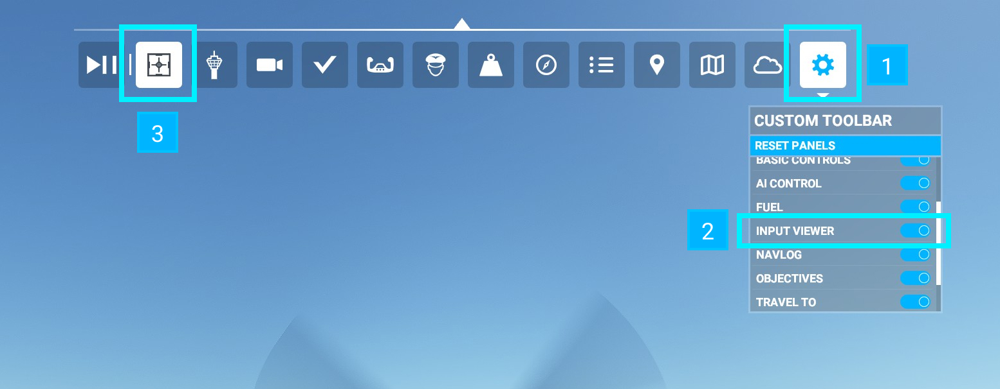
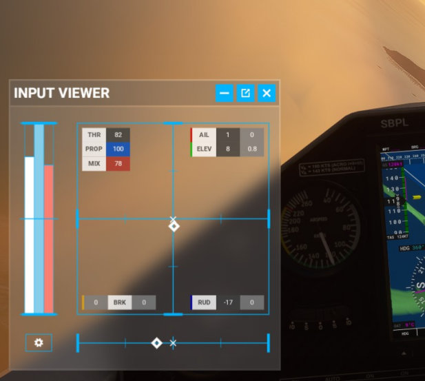
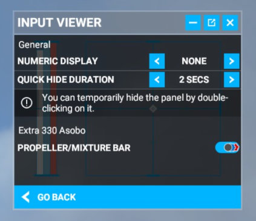
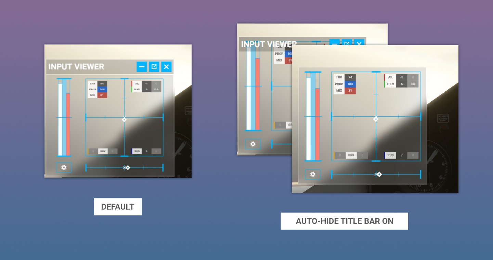
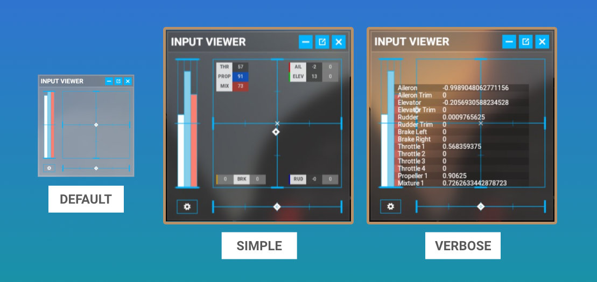
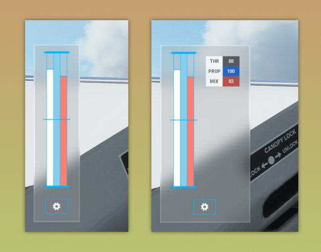

# Input Viewer - In-Game Panel addon for MSFS2020

----

<a href="https://flightsim.to/file/14925/input-viewer">
Download Input Viewer on Flightsim.to
</a>

----

Do you want to inspect your controls without looking at internal 3D models like throttle levers? Or, you want to brag about how good you are at controlling aircraft in your recording videos? Well, here is an easy solution!

This tiny addon adds an in-game panel that shows several axis inputs for MSFS.

As some of you may know, this is a rip-off of **Controls Indicator** feature from DCS (Digital Combat Simulator). Perhaps, other flight sims might have a similar feature.

This input viewer covers the following input axes:

- Aileron input/trim position
- Elevator input/trim position
- Rudder input/trim position
- Wheel brakes
- Throttle #1/2/3/4
- Propeller RPM #1
- Mixture #1

Prop RPM #2-4 and Mixture #2-4 are not included.

## Installation

Copy `spitice-ingamepanels-inputviewer` folder to community package folder.

If you wonder what the community package folder is, googling for "msfs community package directory" might help.

To uninstall, simply remove `spitice-ingamepanels-inputviewer` from your community package folder.

## Usage

You should find a custom panel icon in your in-game toolbar. Click it to activate the panel.

If it doesn't appear, access the list of in-game panels by clicking the gear icon, then toggle "INPUT VIEWER" on. It should add the panel icon to your toolbar.

The initial position of the panel might be the top right of your screen. Drag the header and the border to move and resize the panel as you want.

### Configuration

Click the "gear" button located at the bottom left of the panel to open the configuration menu.

### Auto-hide Title Bar

***Default value: Disabled***

By enabling this feature, the title bar will automatically become invisible when your cursor goes outside of the panel.

### Number Display

***Default value: None***

InputViewer contains two types of number display for each axis. Default is none, so you need to manually activate this feature via configuration.

Perhaps, you will notice that trim numbers in the simple number display sometimes showing two different types of zero: "0" and "0.0". When you tweak those values via keys or buttons, not via axis, sometimes it causes a rounding error, in which the fraction digits would not be completely zeroed out thus it becomes a very small number. As a result, the simple number display shows "0" for the perfect zero value and "0.0" for those "almost zero" values.

### Show Panels

***Default value: All***

This feature is added for users who don't need all types of inputs to be visible. For now, you can select "Throttle" to hide the stick and rudder (right side of the panel) so your input viewer will be smaller. Use this feature in conjunction with "Auto-hide Title Bar" for more effectiveness.

### Quick Hide

***Default duration: 2 seconds***

By double-clicking inside of the panel, you can temporarily hide it so it won't ruin your masterpiece when you take screenshots! The duration for quick hiding is two seconds by default. You can choose 1, 2, or 3 seconds as the duration or make the feature completely disabled in the configuration screen.

### Propeller/Mixture Bar

***Default value: Automatic for Aircrafts in Standard edition***

As of v1.1, you can tweak the visibility of the propeller/mixture bar in the configuration screen and the addon will remember which option is chosen for each aircraft model. By default, this option will be automatically set for those aircraft bundled with MSFS Standard edition.

## Repository

Feel free to fork it and try to make your own input viewer. Any bug reports and suggestions are also welcome :)

https://github.com/spitice/msfs-input-viewer

## Acknowledgements

- [msfs2020-toolbar-window-template](https://github.com/bymaximus/msfs2020-toolbar-window-template)
- [msfs-webui-devkit](https://github.com/dga711/msfs-webui-devkit)

## Changelogs

### v1.2.0 (July 4, 2021)

- Add throttle-only mode
- Add auto-hide title bar
- Zero values are now grayed out in Simple Number Display
- Fix behavior on saving PropMix option
- Fix to prevent quick-hide while panel is externalized

### v1.1.0 (June 27, 2021)

- Add config panel and auto-save config
- Add simple and verbose number display
- Add quick hide feature
- Propeller/Mixture Bar will be automatically set for vanilla aircrafts in Standard edition
- Lower the minimum size of the panel

### v1.0.0 (May 21, 2021)

Initial release.
